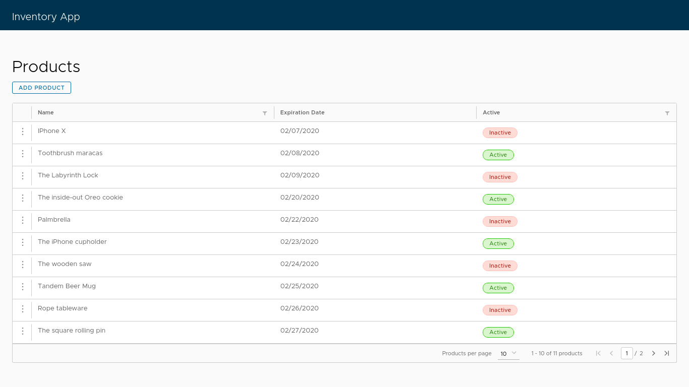
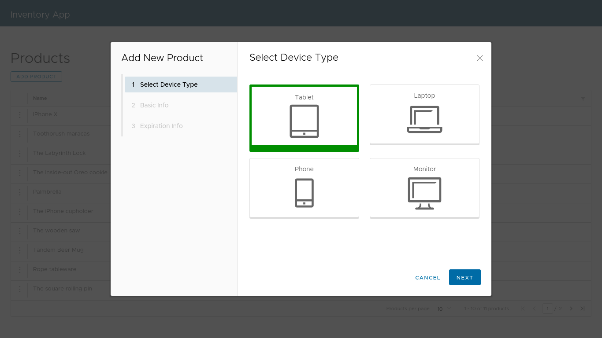

# Angular Inventory App

This is an application for managing an inventory using one of the third-party component libraries that was created by VMware's team, known as the Clarity component. It follows the Clarity Design System, which has detailed UX/UI guidelines that need to be followed for using the components correctly. It also documents do's and don'ts for using each of the components. You can find the documentation at [https://clarity.design](https://clarity.design).

Angular Inventory App displays products and performing **Create**, **Read**, **Update**, and **Delete** (**CRUD**) operations.

## Demo

Here is a working live demo: [https://lwairore.github.io/angular-inventory-app/](https://lwairore.github.io/angular-inventory-app/)

This is how the Angular Inventory App looks:

### Add new product

# Built with

- [Clarity's wizard component library](https://clarity.design/) and used reactive forms - To create complex form via a step-by-step workflow so that we can add/edit products.
- Built-in validations from Angular and custom validator.
- [Angular](http://angular.io/)

## Team

[Karangu Lucas](https://github.com/lwairore)

## Further reading
The following reading material will provide you with more information about Clarity components, reactive forms, and validations:

- Clarity Design documentation: [https://clarity.design/](https://clarity.design/).
- Angular documentation on reactive forms: [https://angular.io/guide/reactive-forms](https://angular.io/guide/reactive-forms).
- Angular documentation on form validations: [https://angular.io/guide/form-validation](https://angular.io/guide/form-validation).
